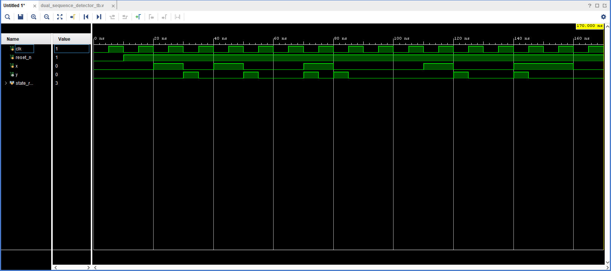

# lab-7---fsms-berberian-minas-snyder-chandler
lab-7---fsms-berberian-minas-snyder-chandler created by GitHub Classroom

 Testbench Screencap for dual sequence detector: 
 
 Testbench screencap for even odd conseq: 
 
 Testbench screencap for conseq sequence: 
